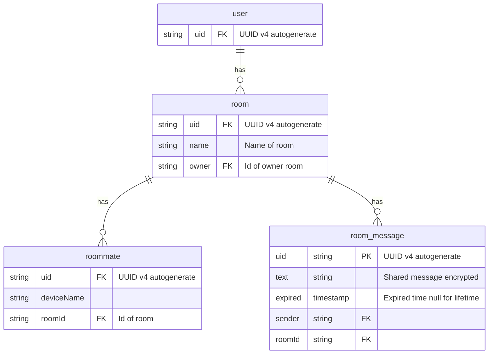

# Er Diagram

```mermaid
erDiagram
    user {
        string uid FK "UUID v4 autogenerate"
    }

    room {
        string uid FK "UUID v4 autogenerate"
        string name "Name of room"
        string owner FK "Id of owner room"
    }

    roommate {
        string uid FK "UUID v4 autogenerate"
        string deviceName ""
        string roomId FK "Id of room"
    }

    room_message {
        uid string PK "UUID v4 autogenerate"
        text string "Shared message encrypted"
        expired timestamp "Expired time null for lifetime"
        sender string FK
        roomId string FK
    }

    room ||--o{ roommate : has
    user ||--o{ room : has
    room ||--o{ room_message: has
```